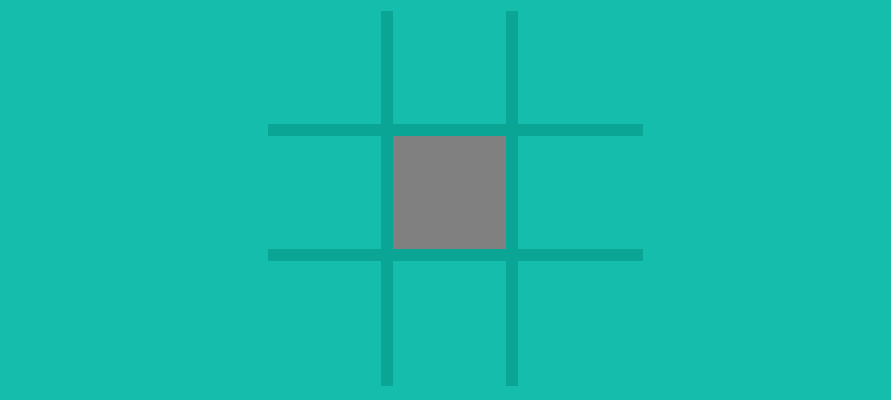
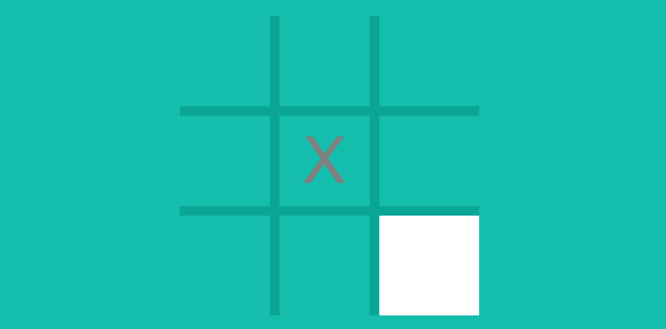
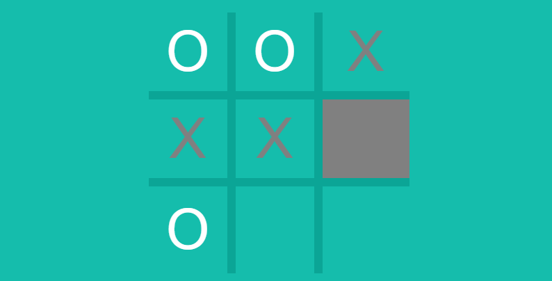
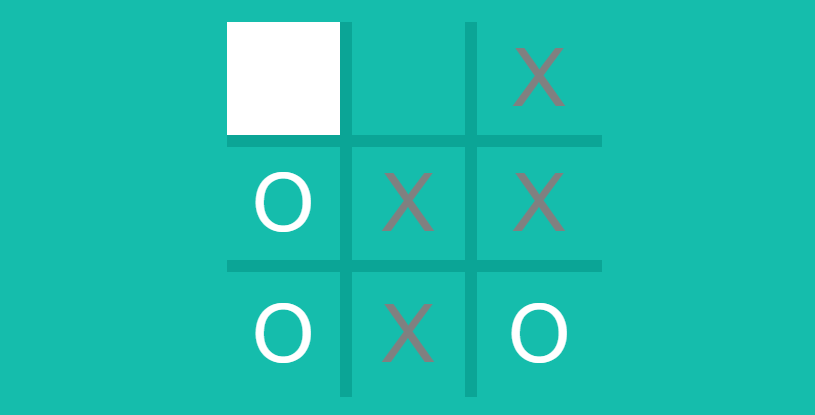
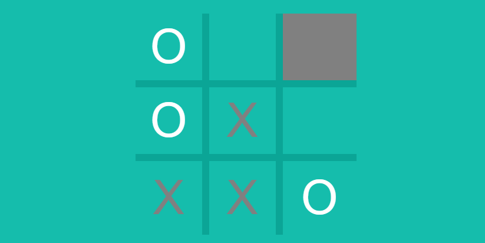

# tic-tac-toe

This project simulates the paper-and-pencil game Tic-tac-toe between two players. The players take turns marking the spaces on the three-by-three grid with one of the players marking the spaces with squares and the other player marking the spaces with noughts. The player who marks three spaces in a row, column, or diagonal wins the game.

This project takes inspiration from Google's version od Tic-tac-toe on Google Chrome. Google is known to have incorporated incorporated interactive games and features as small easter eggs such as the Dinosaur Game when there is no internet connection and the Google Doodle to commemorate holidays, historical events, and the legacy of historical figures. Their version of Tic-tac-toe is playable through the web browser and is part of their bundle of games available on their browser which include other popular games such as Snake and Minesweeper. Click [here](https://www.google.com/search?q=tic+tac+toe&oq=Tic+Tac+Toe&gs_lcrp=EgZjaHJvbWUqDggAEEUYJxg7GIAEGIoFMg4IABBFGCcYOxiABBiKBTIGCAEQRRhAMgwIAhAAGEMYgAQYigUyDwgDEAAYQxixAxiABBiKBTIMCAQQABhDGIAEGIoFMgYIBRBFGDwyBggGEEUYPDIGCAcQRRg80gEINDQ1MmowajSoAgCwAgE&sourceid=chrome&ie=UTF-8) to check out their version of the game.

## How to Play

### Heads-Up Display


The top of the screen shows the names of the players and the current turn. The names of the players are shown alongside a mark for players to keep track of the squares they have marked. The squares with the crosses correspond to the squares the first player marked  and the squares with the nughts correspond to the squares the second player marked. The teal color around the name of the first player is the visual indication that the current turn is their turn.

### Marking Square on Grid

Mouse and trackpad users left-click on a square on the grid to mark the square. Squares which have already been marked cannot be marked.

Screen-readers users such as those with visual impairments, cognitive impairments, and motor disabilities have the option to play the game with keyboard. The following table contains the keyboard controls and controls for screen-reader users to move through and focus the squares of the grid and mark the focused square.

| Keyboard Shortcuts | Action |
| -------------- | ------ |
| ```TAB```      | Focus next square on the grid
| ```SHIFT + TAB``` | Focus previous square on the grid
| ```ENTER``` | Mark focused square

The following images demonstrate the visual indication for screen-reader users to determine whether a square is focused.



When the current turn is the first player's turn, the square is colored grey as a visual indication that the square is focused.




When the second player's turn is the current turn, the square is colored white as a visual indication that the square is focused.

### How to Win

The objective of the game is to be the player with three marks in a row, column, or diagonal and prevent the other player from marking three consecutive squares. The following images cover the winning conditions and the forced draw which occur when neither player marks three consecutive squares.

#### Three in a Row


The first player is about to win in this scenario because marking the square which is focused would result in three crosses in a row.

#### Three in a Column


The second player is about to win in this scenario because marking the square which is focused would result in three noughts in a column.

#### Three in a Diagonal


The first player is about to win in this scenario because marking the square which is focused would result in three crosses in a diagonal.

#### Forced Draw


The outcome of this scenario is a forced draw because there are no more squares to be marked but the square to be marked does not result in three consecutive marked squares.