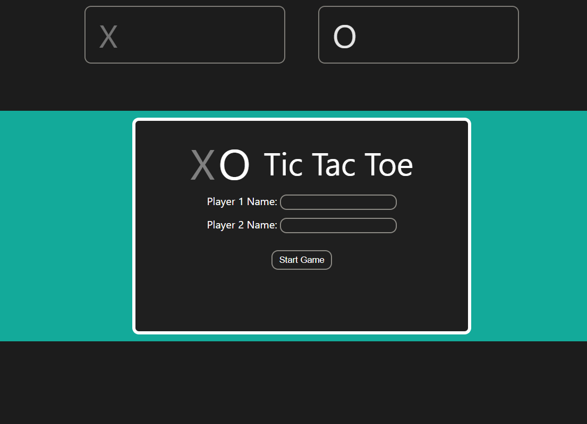

# tic-tac-toe

This project simulates the paper-and-pencil game Tic-tac-toe between two players. The players take turns marking the spaces on the three-by-three grid with one of the players marking the spaces with squares and the other player marking the spaces with noughts. The player who marks three spaces in a row, column, or diagonal wins the game.

This project takes inspiration from Google's version od Tic-tac-toe on Google Chrome. Google is known to have incorporated incorporated interactive games and features as small easter eggs such as the Dinosaur Game when there is no internet connection and the Google Doodle to commemorate holidays, historical events, and the legacy of historical figures. Their version of Tic-tac-toe is playable through the web browser and is part of their bundle of games available on their browser which include other popular games such as Snake and Minesweeper. Click [here](https://www.google.com/search?q=tic+tac+toe&oq=Tic+Tac+Toe&gs_lcrp=EgZjaHJvbWUqDggAEEUYJxg7GIAEGIoFMg4IABBFGCcYOxiABBiKBTIGCAEQRRhAMgwIAhAAGEMYgAQYigUyDwgDEAAYQxixAxiABBiKBTIMCAQQABhDGIAEGIoFMgYIBRBFGDwyBggGEEUYPDIGCAcQRRg80gEINDQ1MmowajSoAgCwAgE&sourceid=chrome&ie=UTF-8) to check out their version of the game.

## How to Play

