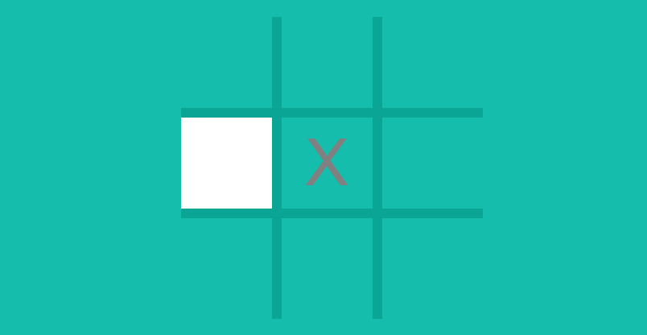

# tic-tac-toe


This project simulates the paper-and-pencil game Tic-tac-toe between two players. The players take turns marking the spaces on the three-by-three grid with one of the players marking the spaces with squares and the other player marking the spaces with noughts. The player who marks three spaces in a row, column, or diagonal wins the game.

This project takes inspiration from [Google's version of Tic-tac-toe](https://www.google.com/search?q=tic+tac+toe&oq=Tic+Tac+Toe&gs_lcrp=EgZjaHJvbWUqDggAEEUYJxg7GIAEGIoFMg4IABBFGCcYOxiABBiKBTIGCAEQRRhAMgwIAhAAGEMYgAQYigUyDwgDEAAYQxixAxiABBiKBTIMCAQQABhDGIAEGIoFMgYIBRBFGDwyBggGEEUYPDIGCAcQRRg80gEINDQ1MmowajSoAgCwAgE&sourceid=chrome&ie=UTF-8) on Google Chrome.

## How to Play

### Heads-Up Display


The top of the screen shows the names of the players and the current turn. The names of the players are shown alongside a mark for players to keep track of the squares they have marked. The squares with the crosses correspond to the squares the first player marked  and the squares with the nughts correspond to the squares the second player marked. The teal color around the name of the first player is the visual indication that the current turn is their turn.

### Marking Square on Grid

Mouse and trackpad users left-click on a square on the grid to mark the square. Squares which have already been marked cannot be marked.

Screen-readers users such as those with visual impairments, cognitive impairments, and motor disabilities have the option to play the game with keyboard. The following table contains the keyboard shortcuts and controls for screen-reader users to move through and focus the squares of the grid and mark the focused square.

| Keyboard Shortcuts | Action |
| -------------- | ------ |
| ```TAB```      | Focus next square on the grid
| ```SHIFT + TAB``` | Focus previous square on the grid
| ```ENTER``` | Mark focused square

The following images demonstrate the visual indication for screen-reader users to determine whether a square is focused. Please refer to the table above for information about keyboard shortcuts and controls mentioned below.


When the current turn is the first player's turn, the square is colored grey as a visual indication that the square is focused. Pressing ```TAB``` would focus the square to the right and pressing ```SHIFT + TAB``` would focus the square to the left. Pressing ```ENTER``` would mark the focused square with a cross.


When the second player's turn is the current turn, the square is colored white as a visual indication that the square is focused. Pressing ```SHIFT + TAB``` would focus the square to the left when the focused square is at the edge of the grid. Pressing ```ENTER``` would mark the focused square with a nought.



Squares which have already been marked cannot be marked. Pressing ```TAB``` would focus the next nearest square which has not been marked which is the square to the right of the square in the middle of the grid.

### How to Win

The objective of the game is to be the player with three marks in a row, column, or diagonal and prevent the other player from marking three consecutive squares. The following images cover the winning conditions and the forced draw which occur when neither player marks three consecutive squares.

#### Three in a Row


The win condition for three in a row occurs when three consecutive squares in a row of the grid are marked. The first player is about to win in this scenario above because marking the focused square would mark all the squares in the second row of the grid.

#### Three in a Column


The win condition for three in a column occurs when three consecutive squares in a column of the grid are marked. The second player is about to win this scenario above because marking the focused square would mark all the squares in the first column of the grid.

#### Three in a Diagonal


The win condition for three in a diagonal occurs when three consecutive squares in the main diagonal or anti-diagonal are marked. The main diagonal stretches from the square in the top lefthand corner to the square in the bottom righthand corner and the anti-diagonal stretches from the square in the bottom lefthand corner to the square in the top righthand corner. The first player is about to win this scenario above because marking the focused square would mark all the squares in the main diagonal.

#### Forced Draw


The forced draw occurs when there are no other squares to be marked but the only square to be marked does not result in three consecutive squares in a row, column, or diagonal to be marked. The scenario above is a forced draw because the last to be marked does not result in three consecutive marked squares for the first player and there are no more squares for the second player to mark after the last square is marked.